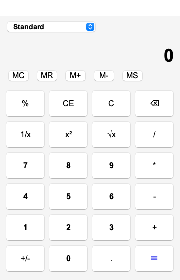
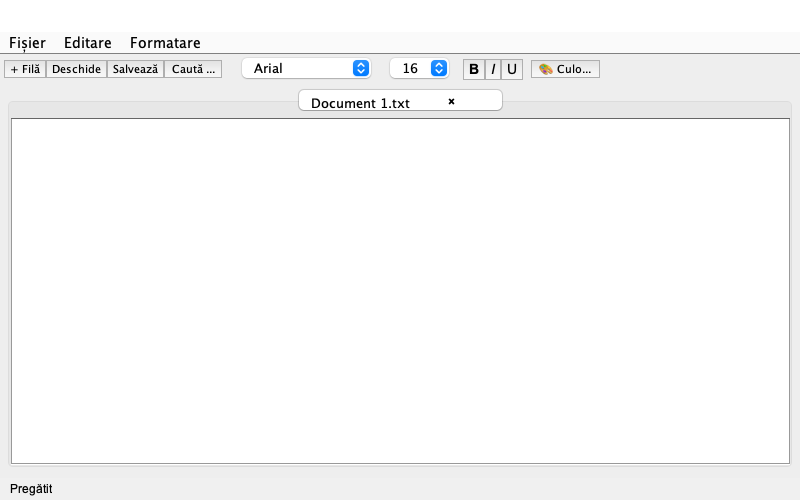
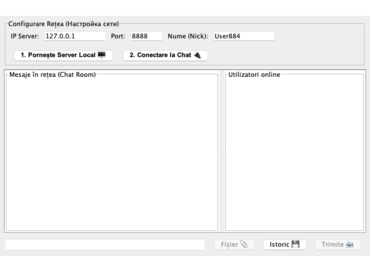
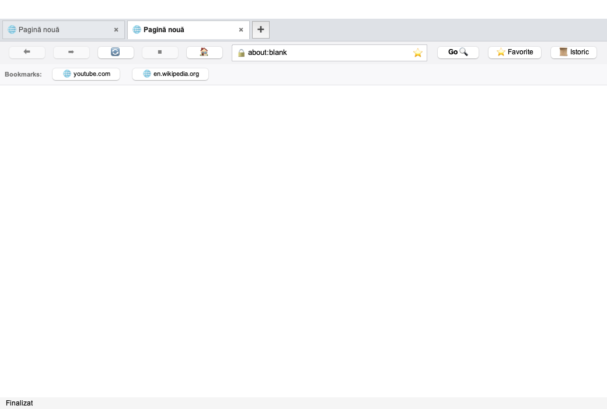
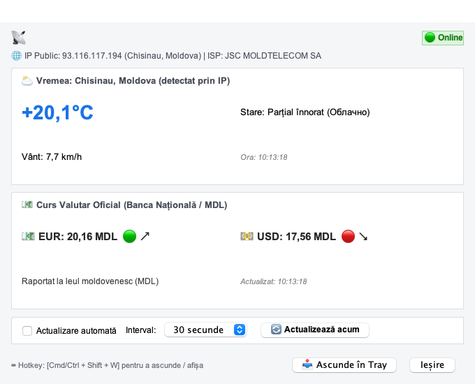

# 🎓 Лабораторные работы по Объектно-Ориентированному Программированию (ООП)

> **Дисциплина:** Парадигмы программирования (Paradigme de programare)  
> **Раздел:** Объектно-ориентированное программирование на Java (POO Java)  
> **Автор:** Студент  
> **Язык разработки:** Java 17+ (OpenJDK 27)  
> **Операционная система:** macOS / Linux / Windows  

---

## 📑 Общая структура репозитория

В репозитории собраны 4 законченные лабораторные работы. Каждая работа находится в своей отдельной папке, полностью автономна, снабжена собственными автоматическими тестами, подробной документацией и скриптом запуска в один клик (`./run.sh`).

```
unic/
├── README.md               # 📖 Главная документация ко всем лабораторным работам
├── .gitignore              # Исключение скомпилированных .class файлов и временных кэшей
│
├── lab1/                   # 🧮 Лабораторная работа 1: Графический Калькулятор (ООП)
│   ├── calculator_screenshot.png # Скриншот интерфейса
│   ├── run.sh              # Скрипт компиляции и запуска
│   ├── README.md           # Подробное описание, ООП-архитектура, шпаргалка к защите
│   └── src/                # Исходный код (Operation, Calculator, Memory)
│
├── lab2/                   # 📝 Лабораторная работа 2: Текстовый редактор
│   ├── editor_screenshot.png # Скриншот интерфейса
│   ├── run.sh              # Скрипт компиляции и запуска
│   ├── README.md           # Описание вкладок, поиска, шрифтов, тесты
│   └── src/                # Исходный код (TextEditor, EditorTab, FileManager)
│
├── lab3/                   # 💬 Лабораторная работа 3: Локальная сеть и Чат (Client-Server)
│   ├── chat_screenshot.png # Скриншот интерфейса
│   ├── run.sh              # Скрипт компиляции и запуска
│   ├── README.md           # Архитектура сокетов, многопоточность, протокол
│   └── src/                # Исходный код (Server, ChatClient, ChatWindow)
│
├── lab4/                   # 🌐 Лабораторная работа 4: Интернет-браузер (WebKit)
│   ├── browser_screenshot.png # Скриншот интерфейса
│   ├── run.sh              # Скрипт запуска и тестирования (./run.sh --test)
│   ├── README.md           # Описание движка WebKit, вкладок, закладок, истории
│   ├── favorites.txt       # Файл сохраненных закладок
│   ├── lib/javafx-sdk/     # Локальный SDK JavaFX (WebKit WebEngine)
│   └── src/                # Модульный код (TabBar, BrowserTab, NavigationBar)
│
└── lab5/                   # 📡 Лабораторная работа 5: Резидентное приложение (System Tray)
    ├── resident_screenshot.png # Скриншот интерфейса
    ├── run.sh              # Скрипт запуска и тестов (./run.sh --test)
    ├── README.md           # Документация, таймер, горячие клавиши, трей
    ├── settings.txt        # Настройки интервала авто-обновления
    └── src/                # Исходный код (WeatherService, CurrencyService, TrayManager)
```

---

## 🖼️ Обзор интерфейсов и функционала лабораторных работ

---

### 🧮 Лабораторная работа №1: Графический калькулятор (Calculator)

<p align="center">
  
</p>

#### Запуск:
```bash
cd lab1 && ./run.sh
```

#### Что реализовано:
* **Базовые арифметические операции:** сложение (`+`), вычитание (`-`), умножение (`*`), деление (`/`).
* **Инженерные и расширенные операции:** квадратный корень (`√x`), возведение в квадрат (`x²`), обратное число (`1/x`), вычисление процентов (`%`), смена знака (`+/-`).
* **Функции памяти (Memory):** `MC` (очистка), `MR` (вызов из памяти), `M+` (прибавление), `M-` (вычитание), `MS` (сохранение).
* **Безопасность:** Перехват деления на ноль (`ArithmeticException`) и вывод дружественного сообщения вместо аварийного закрытия.
* **Принципы ООП:** 
  * Интерфейс `Operation` для полиморфного выполнения математических действий.
  * Наследование от `UnaryOperation` и `BinaryOperation`.
  * Инкапсуляция логики вычислений отдельно от Swing GUI.

---

### 📝 Лабораторная работа №2: Текстовый редактор (Text Editor)

<p align="center">
  
</p>

#### Запуск:
```bash
cd lab2 && ./run.sh
```

#### Что реализовано:
* **Многодокументный интерфейс (MDI / Tabs):** работа с несколькими файлами одновременно во вкладках.
* **Работа с файлами:** открытие текстовых файлов (`.txt`, `.java`, `.md`), сохранение, «Сохранить как...».
* **Форматирование текста:** выбор шрифта (`Font`), размера (кегля), начертания (жирный `B`, курсив `I`, подчеркнутый `U`), цвета текста через палитру `JColorChooser`.
* **Поиск и замена:** диалоговое окно «Найти и заменить» с подсветкой совпадений.
* **Строка состояния:** отображение кодировки, количества символов и статуса готовности.
* **Принципы ООП:** Композиция компонентов (`EditorTab`), обработка событий `DocumentListener` и `ActionListener`.

---

### 💬 Лабораторная работа №3: Локальная сеть и Чат (Client-Server Chat)

<p align="center">
  
</p>

#### Запуск:
```bash
cd lab3 && ./run.sh
```

#### Что реализовано:
* **Архитектура Клиент-Сервер:** возможность запуска локального сервера (`ServerSocket`) на порту 8888 в один клик и подключения клиентов (`Socket`).
* **Многопоточность (Multithreading):** каждый подключенный клиент обрабатывается в отдельном потоке `ClientHandler`, что исключает блокировку графического интерфейса.
* **Список онлайн-пользователей:** автоматическое оповещение о подключении и отключении участников.
* **История сообщений:** сохранение переписки в файл истории (`Istoric 💾`).
* **Отправка файлов:** поддержка передачи файлов по локальной сети (`Fișier 📎`).
* **Принципы ООП:** Инкапсуляция сетевых сокетов, потокобезопасные очереди сообщений, модель `Message`.

---

### 🌐 Лабораторная работа №4: Интернет-браузер (WebKit Engine)

<p align="center">
  
</p>

#### Запуск:
```bash
cd lab4 && ./run.sh
```
Запуск автоматических тестов (без GUI):
```bash
cd lab4 && ./run.sh --test
```

#### Что реализовано (на максимальные 10 / 10 баллов):
* **Современный движок WebKit:** интеграция JavaFX `WebView` через `JFXPanel`. В отличие от стандартного HTML 3.2 редактора Swing, браузер полноценно воспроизводит **YouTube**, открывает **Google**, Википедию, исполняет **JavaScript** и рендерит стили **CSS3**.
* **Интерфейс в стиле Google Chrome:**
  1. **Вкладки в самом верху (`TabBar`):** выровнены по левому краю, открываются кнопкой `➕`, закрываются крестиком `×`.
  2. **Панель навигации (`NavigationBar`):** кнопки `⬅ Назад`, `➡ Вперед`, `🔄 Обновить`, `⏹ Стоп`, `🏠 Домой`.
  3. **Адресная строка (Omnibox):** значок `🔒`, авто-добавление в закладки по клику на звездочку `⭐`, умный поиск в Google при вводе поискового запроса.
  4. **Панель закладок (`BookmarksBar`):** быстрые кнопки перехода (`🌐 youtube.com`, `🌐 wikipedia.org`) прямо под строкой поиска.
  5. **Визуализация сетевых запросов:** по центру экрана при отправке запроса появляется плашка со статусом `HTTP GET`, шкалой прогресса `0% -> 100%` и обработкой ошибок подключения.
  6. **История посещений (`HistoryManager`):** журнал со списком сайтов и точным временем `[HH:mm:ss]`.
* **Принципы ООП:** Разделение ответственности (10 модульных классов до 180 строк), паттерн Слушатель (`TabListener`), инкапсуляция.

---

### 📡 Лабораторная работа №5: Резидентное приложение (System Tray & Meteo/Valută)

<p align="center">
  
</p>

#### Запуск:
```bash
cd lab5 && ./run.sh
```
Запуск автоматических тестов (без GUI):
```bash
cd lab5 && ./run.sh --test
```

#### Что реализовано (на максимальные 10 / 10 баллов):
* **Подключение к онлайн-сервисам и IP-геолокация (пункт a, 5 баллов):** 
  * Автоматическое определение **публичного IP-адреса, провайдера (ISP), города и точных координат** через `ip-api.com`.
  * Запрос текущей погоды в реальном времени через **Open-Meteo API** по координатам пользователя (температура, скорость ветра, погодные условия).
  * Официальные курсы валют **EUR** и **USD** к молдавскому лею (**MDL**) с определением тренда (рост 🟢 / падение 🔴).
  * Встроенный офлайн-режим (`Offline Local`) при отсутствии сети.
* **Сворачивание в системный трей (пункт b, +1 балл):** 
  * Приложение сворачивается в трей (`SystemTray`, `TrayIcon`) по нажатию кнопки «Ascunde în Tray» или крестика `×`.
  * При сворачивании отправляется системное уведомление.
* **Настройка периода авто-обновления (пункт c, +1 балл):**
  * Таймер `javax.swing.Timer` для регулярного опроса данных.
  * Выбор интервала (5 сек, 15 сек, 30 сек, 1 мин) с сохранением в файл `settings.txt`.
* **Динамическая иконка в трее (пункт d, +2 балла):**
  * Программная генерация иконки `BufferedImage` на лету: солнце ☀️ при ясной погоде, облака ☁️, дождь 🌧️.
  * Всплывающая подсказка в трее со сводкой погоды и курсов.
* **Горячие клавиши (пункт e, +1 балл):**
  * Глобальная комбинация клавиш **`Cmd + Shift + W`** (на Mac) или **`Ctrl + Shift + W`** для мгновенного показа/скрытия окна.
* **Принципы ООП:** Разделение ответственности (SRP), паттерн Наблюдатель (`TrayListener`), многопоточность (`new Thread(...)` + `SwingUtilities.invokeLater`).

---

## 🛠️ Требования к окружению

1. **Java Development Kit (JDK):** версия 17 или выше (проверено на OpenJDK 27).
2. **Bash:** стандартный командный интерпретатор macOS / Linux.
3. Скрипты `run.sh` автоматически находят установленный Homebrew OpenJDK (`/opt/homebrew/opt/openjdk` или `/usr/local/opt/openjdk`).

---

## 🧪 Автоматическое тестирование

В каждой лабораторной работе есть класс с автоматическими тестами (`Test...`), проверяющий корректность бизнес-логики:
* Проверка граничных условий и исключений.
* Сохранение и загрузка данных из файлов.
* Корректность сетевых запросов и разбора адресов.
